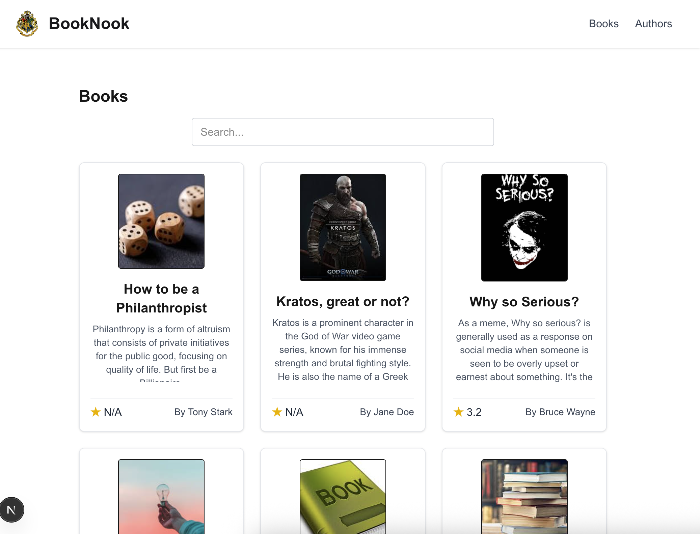
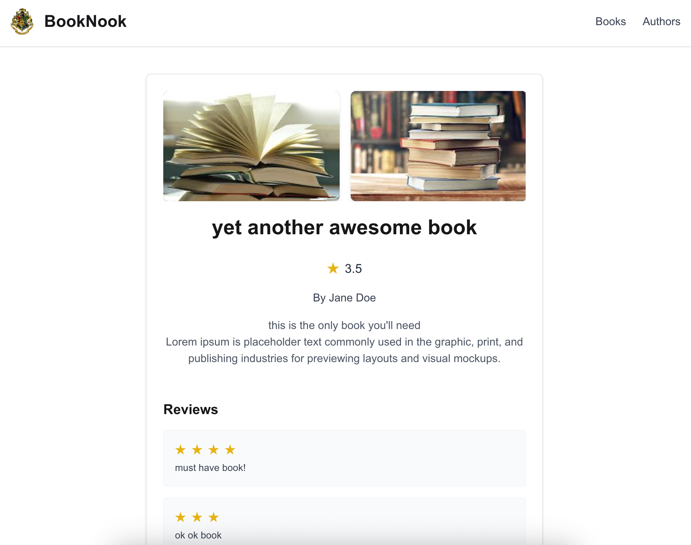
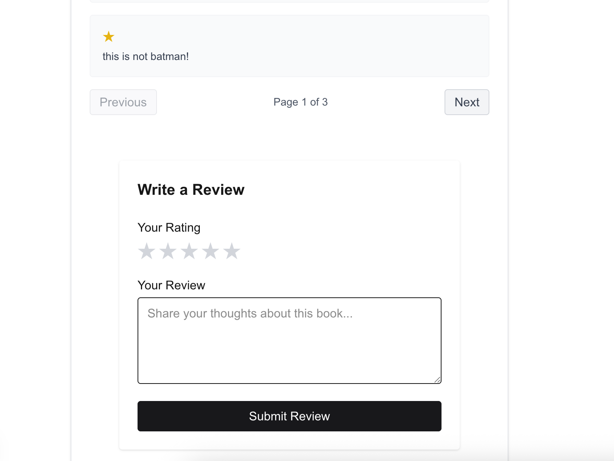
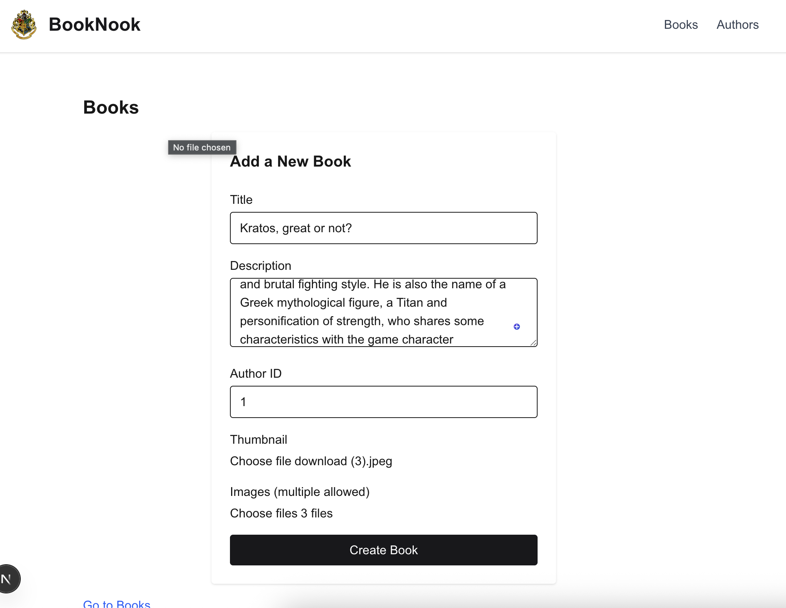
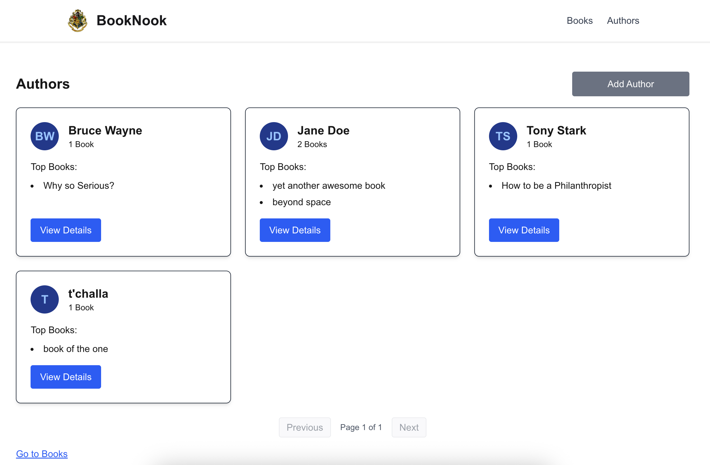
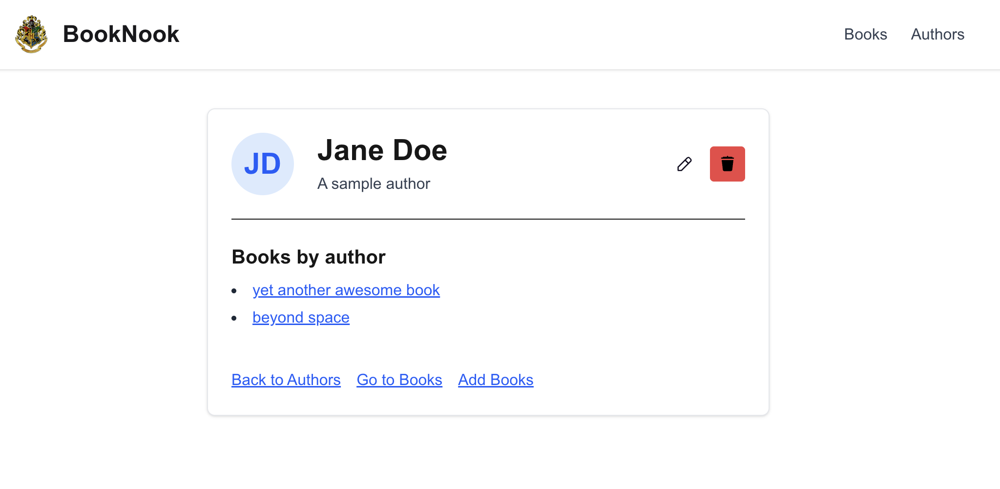

# BookNook

A full-stack application for managing books and authors, featuring both REST and GraphQL APIs, file uploads, and a modern frontend.

## Project Structure

- `backend/` — Node.js/Express backend with REST and GraphQL APIs
- `frontend/` — Next.js React frontend

## Getting Started

1. **Clone the repository**
   ```sh
   git clone <your-repo-url>
   cd booknook
   ```

2. **Setup Backend**
   See [backend/README.md](backend/README.md) for detailed backend setup instructions.

3. **Setup Frontend**
   See [frontend/README.md](frontend/README.md) for detailed frontend setup instructions.

4. **Run the Application**
   - Start the backend and frontend servers as described in their respective README files.
   - Access the frontend at `http://localhost:3000` (default) and backend API at `http://localhost:4000` (default).

## Screenshots

Below are some screenshots of the BookNook app in action:

| Home Page | Book Details | Book Review |
|-----------|--------------|-------------|
|  |  |  |


| Add Book | List Author | Edit Author |
|-----------|--------------|-------------|
|  |  |  |


---

For more details, see the backend and frontend README files.
